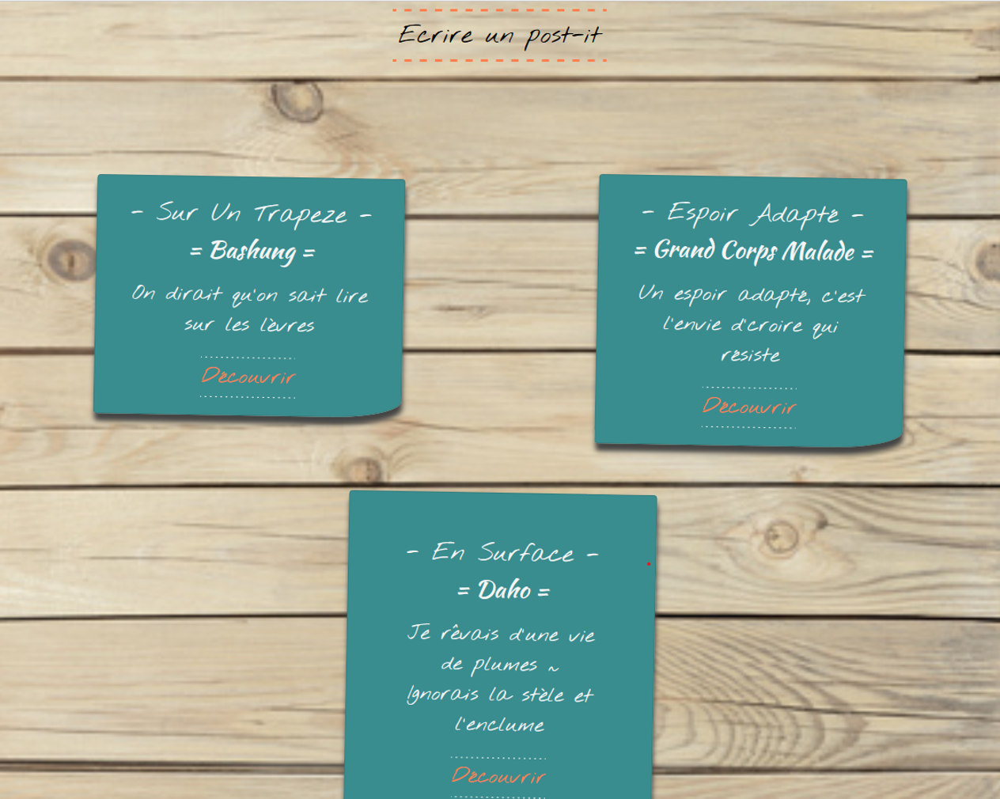

# A-todo-dashboard-with-Vue.js-3-and-the-localstorage



Student Project: Create an interactive dashboard where you can pin, delete and update notes.

## Project setup
```
npm install
```

### Compiles and hot-reloads for development
```
npm run serve
```

### Compiles and minifies for production
```
npm run build
```

### Lints and fixes files
```
npm run lint
```

### Customize configuration
See [Configuration Reference](https://cli.vuejs.org/config/).
